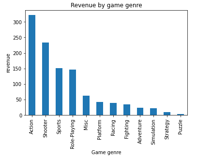
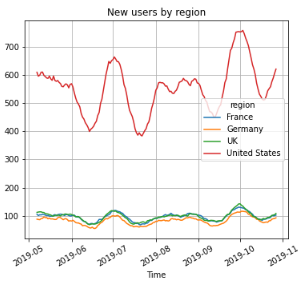

  
  &nbsp; 

# 2022 Yandex Data Analysis Workshop

  
  &nbsp; 

	
  :star: **Star me on GitHub — it motivates me a lot!** :star:
	

  
  &nbsp; 

Some of my projects completed on the course "Data Analysis" from Yandex Practicum in 2022

## :book: &nbsp; Table of Contents
* [Basic skills mastered in the course](#rocket--basic-skills-mastered-in-the-course)
* [Examples of completed projects](#scroll--examples-of-completed-projects)
* [Course program](#date--course-program)

## :rocket: &nbsp; Basic skills mastered in the course
- Unload, transform, and clean up data using SQL queries.
- Create dashboards using BI tools.
- Run A/B testing to test hypotheses.
- Calculate the key metrics of the company's work and evaluate their significance.

## :scroll: &nbsp; Examples of completed projects

  
  &nbsp; 

| Project name | Description | Dependencies | Illustration | 
| :---------------------- | :---------------------- | :-- | :---------------------- |
| [Video games success patterns](https://github.com/Anton-NS/2022_yandex_data_analysis_workshop/tree/main/sprint_05_game_ratings) | The aim of the project was to identify patterns that determine the success of the game. The main patterns turned out to be the platform and genre. | *pandas, numpy, matplotlib.pyplot, seaborn, pathlib, scipy, IPython.display* |  |
| [Loss analysis of the Procrastinate Pro+ application](https://github.com/Anton-NS/2022_yandex_data_analysis_workshop/tree/main/sprint_07_loss_analysis) | Despite huge investments in advertising, the company has been suffering losses for the last few months. The task is to understand the reasons and help the company become profitable again. | *pandas, numpy, matplotlib.pyplot, seaborn, pathlib, scipy, IPython.display, datetime* |  |
## :date: &nbsp; Course program
- Basic Python
- Data Preprocessing
- Eploratory Data analysis
- Statistical data analysis
- SQL
- Business indicators analysis
- Data-driven business decision making
- How to Tell a Story with Data
